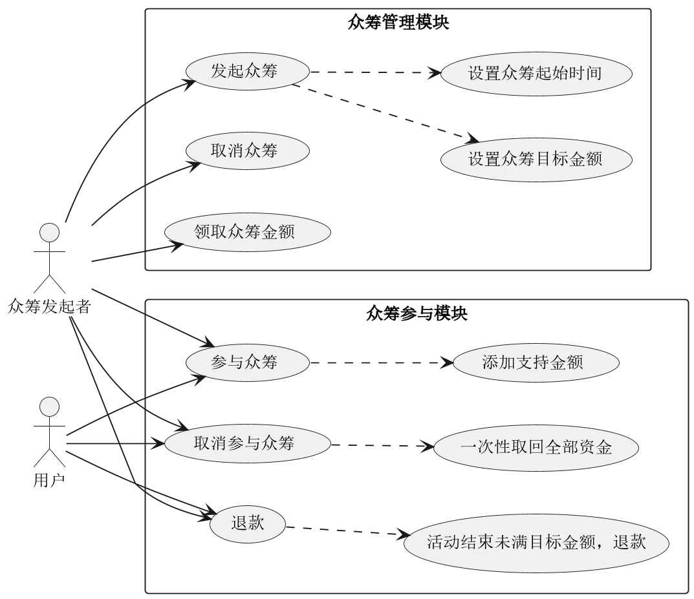
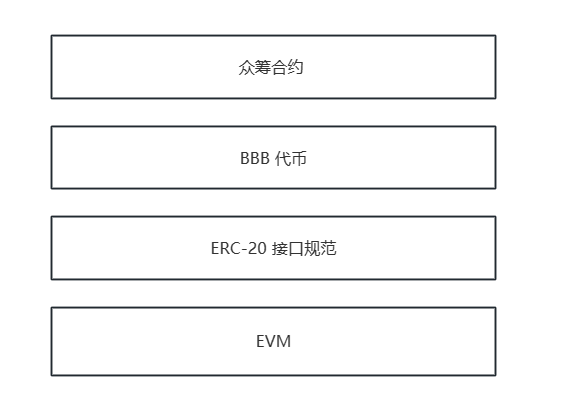

# 一、需求描述

背景：在当今数字货币时代，众筹已成为一种流行的资金筹集方式。为了简化众筹流程、确保资金安全和透明度，开发一个基于以太坊区块链的智能合约。

目的：开发一个智能合约，允许用户发起众筹活动、参与众筹、领取资金以及退款。

相关功能点如下：

- **发起众筹：**
  - 用户可以在合约中发起众筹活动
  - 发起者需要指定目标筹资金额、众筹开始时间和结束时间（众筹开始时间必须晚于当前时间，结束时间必须晚于开始时间且在未来90天内）
  
- **取消众筹：**

  - 发起者可以取消自己发起的众筹活动（只能在众筹开始前取消）

- **参与众筹：**

  - 用户可以参与众筹活动，向指定众筹活动发送代币（已经参与过的用户可以再次参与）
  - 用户需要指定众筹活动的ID和发送的代币数量（众筹活动必须处于进行中）

- **取消参与：**

  - 用户可以取消自己的众筹支持（众筹活动必须处于进行中）

- **领取资金**

  - 当众筹活动结束时，发起者可以领取众筹资金
  - 只有众筹发起者才能领取资金
  - 众筹活动必须已结束且已达到目标筹资金额

- **退款：**

  - 当众筹活动结束时，如果未达到目标筹资金额，参与者可以申请退款
  - 只有参与了未达到目标的众筹活动的用户才能申请退款
  - 退款将退还参与者的贡献金额
  - 退款后将触发退款事件


# 二、用例分析





# 三、整体方案



# 四、智能合约核心设计

## 4.1 众筹活动详情结构体

相当于`Java`的内部类

- 活动的发起者
- 总目标筹资金额
- 已经筹集的金额
- 活动开始时间（时间戳，单位：秒）
- 活动结束时间（时间戳，单位：秒）
- 目标是否已达成并且发起者已领取资金，默认值是`false`

## 4.2 智能合约成员变量

- 使用代币，使用`ERC-20`合约，该变量不可修改；
- 活动计数器，已创建的众筹活动总数，采用自增的方式（默认值是0个），并将活动的序位作为全局唯一`ID`；
- 众筹活动信息，将众筹活动的`ID`与众筹活动的具体信息进行关联，使用HashMap；
- 参与者信息，每个用户参与者对于每个众筹活动的贡献金额，一个用户可以参与多个活动，活动`ID ` -> 用户`ID` -> 用户参与活动的金额（非负数）

## 4.3 构造函数

将代币合约的地址传递给该众筹合约，以便后续的众筹活动可以使用该代币进行交易；采用的代币需要符合`ERC-20`接口规范。

## 4.4 成员函数

### 4.4.1 发起众筹活动

#### 参数：

- 总目标筹资金额；
- 众筹活动的开始时间戳，单位：秒，使用`int32`即可；
- 众筹活动的结束时间戳，单位：秒，使用`int32`即可；

#### 逻辑：

1. 特判：确保众筹活动的合法性和有效性
   1. 开始时间必须晚于当前时间；
   2. 结束时间晚于等于开始时间；
   3. 结束时间不超过90天。
2. 将活动计数器自增 1，生成新的众筹活动的`ID`；
3. 创建活动对象，并将其存入众筹活动信息中；
4. 输出事件：创建众筹活动，记录活动`ID`、发起人地址、目标金额、起始时间。

### 4.4.2 取消众筹活动

#### 参数：

- 众筹活动的ID，用于唯一标识要取消的众筹活动。

#### 逻辑：

1. 特判：确保取消众筹活动的合法性和有效性
   1. 确保活动存在，即众筹活动的ID对应的活动信息不为空；
   2. 确保取消操作在众筹开始前进行，即当前时间早于众筹活动的开始时间；一旦开始，无法取消。
2. 删除众筹活动信息，释放资源；
3. 输出事件：取消众筹活动，记录被取消的活动ID。

### 4.4.3 参与众筹活动

#### 参数：

- 众筹活动的ID，用于唯一标识参与的众筹活动；
- 参与的代币数量。

#### 逻辑：

1. 特判：确保参与众筹活动的合法性和有效性
   1. 确保众筹活动存在，即众筹活动的`ID`对应的活动信息不为空；
   2. 确保众筹活动仍在进行中，即当前时间早于众筹活动的结束时间。
2. 更新众筹活动信息：
   1. 增加已筹资金额
   2. 增加参与者的贡献金额；
   3. 扣除参与者的代币，并将代币转入合约地址。
3. 输出事件：记录参与众筹的活动 `ID` 、参与者地址和贡献的代币数量。

### 4.4.4 取消参与众筹活动

#### 参数：

- 众筹活动的ID，用于唯一标识要取消参与的众筹活动；
- 取消参与的代币数量。

#### 逻辑：

1. 特判：确保取消参与众筹活动的合法性和有效性
   1. 确保众筹活动存在，即众筹活动的ID对应的活动信息不为空；
   2. 确保取消操作在众筹活动进行中，即当前时间早于众筹活动的结束时间。
2. 更新众筹活动信息：先修改账本状态，再转账
   1. 减少已筹资金额
   2. 减少参与者的贡献金额，（若是参与了500，取回1000，会报错导致函数执行异常，数据回滚，因为金额必须是非负数）
   3. 将参与者的代币退还给参与者。
3. 输出事件：记录取消参与的众筹活动ID、参与者地址和取消的代币数量。

### 4.4.5 领取资金

#### 参数：

- 众筹活动的ID，用于唯一标识要领取资金的众筹活动。

#### 逻辑：

1. 特判：确保领取资金操作的合法性和有效性
   1. 确保众筹活动存在，即众筹活动的ID对应的活动信息不为空；
   2. 确保领取操作由众筹发起者执行，即当前调用合约的地址与众筹发起者地址一致；
   3. 确保众筹活动已经结束，即当前时间晚于众筹活动的结束时间；
   4. 确保众筹活动已达到目标筹资金额，即已筹资金额大于等于目标筹资金额；
   5. 确保众筹发起者尚未领取资金，即 `claimed` 标志为 `false`。
2. 更新众筹活动信息：先修改账本状态，再转账
   1. 设置 `claimed` 标志为 `true`，表示众筹发起者已经领取资金；
   2. 将合约中的代币转移给众筹发起者，即将已筹资金额转移给众筹发起者。
3. 输出事件：记录领取资金的众筹活动ID。

### 4.4.6 退款

#### 参数：

- 众筹活动的ID，用于唯一标识要退款的众筹活动。

#### 逻辑：

1. 特判：确保退款操作的合法性和有效性
   1. 确保众筹活动存在，即众筹活动的ID对应的活动信息不为空；
   2. 确保众筹活动已经结束，即当前时间晚于众筹活动的结束时间；
   3. 确保众筹活动未达到目标筹资金额，即已筹资金额小于目标筹资金额。
2. 计算参与者的贡献金额；
3. 更新众筹活动信息：先修改账本状态，再转账
   1. 将参与者的贡献金额清零；
   2. 将合约中的代币转移给参与者，即将参与者的贡献金额退还给参与者。
4. 输出事件：记录退款的众筹活动ID、参与者地址和退款的代币数量。

# 五、详细功能设计

## 5.1 代码

详见本文件夹下的`CrowdFund.sol`文件，有注释。

## 5.2 ABI

```json
[
	{
		"inputs": [
			{
				"internalType": "uint256",
				"name": "_id",
				"type": "uint256"
			}
		],
		"name": "cancel",
		"outputs": [],
		"stateMutability": "nonpayable",
		"type": "function"
	},
	{
		"inputs": [
			{
				"internalType": "address",
				"name": "_token",
				"type": "address"
			}
		],
		"stateMutability": "nonpayable",
		"type": "constructor"
	},
	{
		"anonymous": false,
		"inputs": [
			{
				"indexed": false,
				"internalType": "uint256",
				"name": "id",
				"type": "uint256"
			}
		],
		"name": "Cancel",
		"type": "event"
	},
	{
		"inputs": [
			{
				"internalType": "uint256",
				"name": "_id",
				"type": "uint256"
			}
		],
		"name": "claim",
		"outputs": [],
		"stateMutability": "nonpayable",
		"type": "function"
	},
	{
		"anonymous": false,
		"inputs": [
			{
				"indexed": false,
				"internalType": "uint256",
				"name": "id",
				"type": "uint256"
			}
		],
		"name": "Claim",
		"type": "event"
	},
	{
		"inputs": [
			{
				"internalType": "uint256",
				"name": "_goal",
				"type": "uint256"
			},
			{
				"internalType": "uint32",
				"name": "_startAt",
				"type": "uint32"
			},
			{
				"internalType": "uint32",
				"name": "_endAt",
				"type": "uint32"
			}
		],
		"name": "launch",
		"outputs": [],
		"stateMutability": "nonpayable",
		"type": "function"
	},
	{
		"anonymous": false,
		"inputs": [
			{
				"indexed": false,
				"internalType": "uint256",
				"name": "id",
				"type": "uint256"
			},
			{
				"indexed": true,
				"internalType": "address",
				"name": "creator",
				"type": "address"
			},
			{
				"indexed": false,
				"internalType": "uint256",
				"name": "goal",
				"type": "uint256"
			},
			{
				"indexed": false,
				"internalType": "uint32",
				"name": "startAt",
				"type": "uint32"
			},
			{
				"indexed": false,
				"internalType": "uint32",
				"name": "endAt",
				"type": "uint32"
			}
		],
		"name": "Launch",
		"type": "event"
	},
	{
		"inputs": [
			{
				"internalType": "uint256",
				"name": "_id",
				"type": "uint256"
			},
			{
				"internalType": "uint256",
				"name": "_amount",
				"type": "uint256"
			}
		],
		"name": "pledge",
		"outputs": [],
		"stateMutability": "nonpayable",
		"type": "function"
	},
	{
		"anonymous": false,
		"inputs": [
			{
				"indexed": true,
				"internalType": "uint256",
				"name": "id",
				"type": "uint256"
			},
			{
				"indexed": true,
				"internalType": "address",
				"name": "caller",
				"type": "address"
			},
			{
				"indexed": false,
				"internalType": "uint256",
				"name": "amount",
				"type": "uint256"
			}
		],
		"name": "Pledge",
		"type": "event"
	},
	{
		"inputs": [
			{
				"internalType": "uint256",
				"name": "_id",
				"type": "uint256"
			}
		],
		"name": "refund",
		"outputs": [],
		"stateMutability": "nonpayable",
		"type": "function"
	},
	{
		"anonymous": false,
		"inputs": [
			{
				"indexed": false,
				"internalType": "uint256",
				"name": "id",
				"type": "uint256"
			},
			{
				"indexed": true,
				"internalType": "address",
				"name": "caller",
				"type": "address"
			},
			{
				"indexed": false,
				"internalType": "uint256",
				"name": "amount",
				"type": "uint256"
			}
		],
		"name": "Refund",
		"type": "event"
	},
	{
		"inputs": [
			{
				"internalType": "uint256",
				"name": "_id",
				"type": "uint256"
			},
			{
				"internalType": "uint256",
				"name": "_amount",
				"type": "uint256"
			}
		],
		"name": "unpledge",
		"outputs": [],
		"stateMutability": "nonpayable",
		"type": "function"
	},
	{
		"anonymous": false,
		"inputs": [
			{
				"indexed": true,
				"internalType": "uint256",
				"name": "id",
				"type": "uint256"
			},
			{
				"indexed": true,
				"internalType": "address",
				"name": "caller",
				"type": "address"
			},
			{
				"indexed": false,
				"internalType": "uint256",
				"name": "amount",
				"type": "uint256"
			}
		],
		"name": "Unpledge",
		"type": "event"
	},
	{
		"inputs": [
			{
				"internalType": "uint256",
				"name": "",
				"type": "uint256"
			}
		],
		"name": "campaigns",
		"outputs": [
			{
				"internalType": "address",
				"name": "creator",
				"type": "address"
			},
			{
				"internalType": "uint256",
				"name": "goal",
				"type": "uint256"
			},
			{
				"internalType": "uint256",
				"name": "pledged",
				"type": "uint256"
			},
			{
				"internalType": "uint32",
				"name": "startAt",
				"type": "uint32"
			},
			{
				"internalType": "uint32",
				"name": "endAt",
				"type": "uint32"
			},
			{
				"internalType": "bool",
				"name": "claimed",
				"type": "bool"
			}
		],
		"stateMutability": "view",
		"type": "function"
	},
	{
		"inputs": [],
		"name": "count",
		"outputs": [
			{
				"internalType": "uint256",
				"name": "",
				"type": "uint256"
			}
		],
		"stateMutability": "view",
		"type": "function"
	},
	{
		"inputs": [
			{
				"internalType": "uint256",
				"name": "",
				"type": "uint256"
			},
			{
				"internalType": "address",
				"name": "",
				"type": "address"
			}
		],
		"name": "pledgedAmount",
		"outputs": [
			{
				"internalType": "uint256",
				"name": "",
				"type": "uint256"
			}
		],
		"stateMutability": "view",
		"type": "function"
	},
	{
		"inputs": [],
		"name": "token",
		"outputs": [
			{
				"internalType": "contract IERC20",
				"name": "",
				"type": "address"
			}
		],
		"stateMutability": "view",
		"type": "function"
	}
]
```

## 5.3 流程

### 5.3.1 项目方发布代币

项目方发布代币，使用`ERC-20`来发布，这里为了实验演示，一次性铸造 100 个`BBB`代币给项目方官网地址（地址1），得到代币合约地址（地址2）；

~~~solidity
// SPDX-License-Identifier: MIT
pragma solidity ^0.8.10;

import "https://github.com/OpenZeppelin/openzeppelin-contracts/blob/v4.0.0/contracts/token/ERC20/ERC20.sol";

contract BBBToken is ERC20 {
    constructor(string memory name, string memory symbol) ERC20(name, symbol) {
        // 铸造 100 tokens to msg.sender
        // 创建 100 个具有 18 位小数的代币，也就是总共铸造了 100 * 10^18 个代币。
        // Similar to how
        // 1 dollar = 100 cents
        // 1 token = 1 * (10 ** decimals)
        _mint(msg.sender, 100 * 10**uint(decimals()));
    }
}
~~~

最小单位是 1 `wei`，众筹合约的资金都是最小单位`wei`；

### 5.3.2 项目方部署众筹合约

项目方将众筹合约部署，部署时需要填入代币地址，填入的是`BBB`代币合约地址（地址2），得到众筹合约地址（地址3）；

### 5.3.3 众筹流程示例

为了方便演示项目方，分别向众筹发起者（地址4）、用户1（地址5）、用户2（地址6），用户3（地址7），分别打了1000`wei`；

1. 众筹发起者发起众筹活动，活动`ID`是1，众筹发起者调用众筹合约（地址3）的`launch()`方法众筹 500 `wei`；
2. 用户1想要参加众筹，想向活动1打款，想将自己的所有资金全部打给项目方，参与这个活动必须在代币合约地址（地址2）上授权给众筹合约地址（地址3）固定的代币数量，于是用户1调用代币合约地址（地址2）的`approve()`方法授权给众筹合约地址（地址3）1000`wei`资金，然后众筹合约（地址3）的`pledge()`方法将自己的1000`wei` `all in` 众筹活动1；
3. 用户2不看好该项目，只划转了100`wei`参与了一下；
4. 用户3想参与该项目，但是比较谨慎，想先看看市场情绪，划转了1000`wei`到众筹合约地址（地址3），先参与了300`wei`，看见有人一次性投了1000`wei`后，立马将剩下的700`wei` `all in`；

# 六、部署流程

可以使用在线版`remix`，按照`5.3.3 众筹流程示例`的流程分地址进行部署测试。